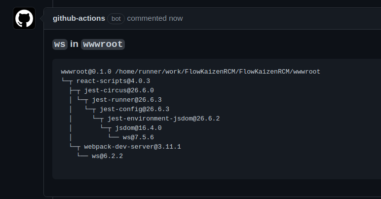

## Pangaea Reusable Workflows

A collection of publicly available [reusable workflows](https://docs.github.com/en/actions/using-workflows/reusing-workflows).

The reusable workflows themselves can be found in the [.github/workflows](.github/workflows) folder. A collection of template workflows which demonstrate example of how to use these workflows can be found in the [workflow-templates](./workflow-templates) folder.

### 1. [Annotate NPM Dependencies](.github/workflows/annotate-npm-dependencies.yml)

Updates a pull request created by dependabot for an NPM-based dependency to
identify the direct dependencies that are impacted.

#### Example Usage:

```yaml
name: My favorite workflow
on:
    pull_request:
        types: [opened, synchronize, reopened]
jobs:
    annotate-npm-dependencies:
        if: ${{ github.event.pull_request.user.login == 'dependabot[bot]' }}
        permissions:
            contents: read
            pull-requests: write
        uses: pangaeatech/.github/.github/workflows/annotate-npm-dependencies.yml@main
        with:
            pr_url: ${{github.event.pull_request.html_url}}
            branch: ${{github.head_ref}}
```

#### Example Output:



### 2. [Add to Redmine](.github/workflows/add-to-redmine.yml)

Adds a new issue to your [Redmine](https://redmine.org/) deployment
for the current pull request. Adds a link to the new issue to the pull request.

#### Example Usage:

```yaml
name: My favorite workflow
on:
    pull_request:
        types: [opened]
jobs:
    add-to-redmine:
        if: ${{ github.event.pull_request.user.login == 'dependabot[bot]' }}
        permissions:
            contents: read
            pull-requests: write
        uses: pangaeatech/.github/.github/workflows/add-to-redmine.yml@main
        with:
            pr_num: ${{github.event.pull_request.number}}
            pr_url: ${{github.event.pull_request.html_url}}
            pr_subject: ${{github.event.pull_request.title}}
            pr_body: ${{github.event.pull_request.body}}
            rm_url: "https://redmine.mycompany.com/"
            rm_project_id: "testproject"
            rm_tracker_id: 13
            rm_version_id: 10
            rm_field_id: 11
        secrets:
            rm_key: ${{ secrets.REDMINE_API_KEY }}
```

### 3. [Link to Redmine](.github/workflows/link-to-redmine.yml)

Links the pull request to an existing issue in your [Redmine](https://redmine.org/) deployment.

#### Example Usage:

```yaml
name: My favorite workflow
on:
  pull_request:
    types: [opened]
jobs:
  extractnum:
    runs-on: ubuntu-latest
      outputs:
        issue: ${{ steps.extract.outputs.replaced }}
      steps:
        - id: extract
          uses: frabert/replace-string-action@v2
          with:
            pattern: "^(task|issue|bug)(\\d+)-.*$"
            flags: "i"
            string: "${{ github.head_ref }}"
            replace-with: "$2"

  link-to-redmine:
    needs: extractnum
    if: ${{ needs.extractnum.outputs.issue != github.head_ref }}
    permissions:
      contents: read
      pull-requests: write
    uses: pangaeatech/.github/.github/workflows/link-to-redmine.yml@main
    with:
      pr_num: ${{github.event.pull_request.number}}
      pr_url: ${{github.event.pull_request.html_url}}
      rm_url: "https://redmine.mycompany.com/"
      rm_issue: ${{ needs.extractnum.outputs.issue }}
      rm_field_id: 11
    secrets:
      rm_key: ${{ secrets.REDMINE_API_KEY }}
```

### 4. [Update Redmine](.github/workflows/update-redmine.yml)

Updates any issues in your [Redmine](https://redmine.org/) deployment which are linked to the specified pull request.

#### Example Usage:

```yaml
name: My favorite workflow
on:
    pull_request_review:
        types: [submitted]
jobs:
    update-redmine:
        permissions:
            contents: read
        uses: pangaeatech/.github/.github/workflows/update-redmine.yml@main
        with:
            pr_num: ${{github.event.pull_request.number}}
            cmt_url: ${{github.event.review.html_url}}
            cmt_user: ${{github.event.review.user.login}}
            cmt_body: ${{github.event.review.body}}
            cmt_action: ${{github.event.review.state}}
            rm_url: "https://redmine.mycompany.com/"
            rm_project_id: "testproject"
            rm_field_id: 11
        secrets:
            rm_key: ${{ secrets.REDMINE_API_KEY }}
```

### 4. [Edit Redmine](.github/workflows/edit-redmine.yml)

Changes the titles and descriptions of any issues in your [Redmine](https://redmine.org/) deployment which are linked to the specified pull request.

#### Example Usage:

```yaml
name: My favorite workflow
on:
    pull_request_review:
        types: [submitted]
jobs:
    edit-redmine:
        if: ${{ github.event.pull_request.user.login == 'dependabot[bot]' }}
        permissions:
            contents: read
        uses: pangaeatech/.github/.github/workflows/edit-redmine.yml@main
        with:
            pr_num: ${{github.event.pull_request.number}}
            pr_url: ${{github.event.pull_request.html_url}}
            pr_subject: ${{github.event.pull_request.title}}
            pr_body: ${{github.event.pull_request.body}}
            rm_url: "https://redmine.mycompany.com/"
            rm_project_id: "testproject"
            rm_field_id: 11
        secrets:
            rm_key: ${{ secrets.REDMINE_API_KEY }}
```
